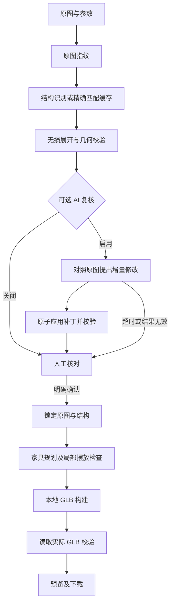

# 户型图到三维的流程设计

适用场景：本地单人，浏览器连接本机服务。使用现有 Codex CLI 登录及所选模型，生成 GLB 无需 Blender。

## 职责分工

AI 负责理解图片和提出家具布局；程序负责数据约束、几何构建与实际模型校验。用户负责核对图像理解中的歧义。

## 结构识别

采用紧凑数据传输，减少重复字段；坐标用 `[x,y]`，内部仍展开为标准 Layout。保留坐标精度、厚度、高度、开口范围、门扇方向、空间材质和证据灯位，不简化轮廓或强制轴对齐。

使用 Pydantic 和几何检查约束输出。无效多边形、开口越界及失效引用需要修正；疑似重复墙、入口遗漏等启发式判断作为核对提醒，不自动改写原图结构。

无尺寸标注时保存估算依据。AI 自报置信度仅供参考，不能作为图片理解正确性的证明。

## 增量复核

独立角色对照原图检查轮廓、比例、房间、墙体、开口和通行。只输出有依据的增删改补丁，带原结构版本及对象 ID。

补丁在副本中一次性应用并完整校验；未知 ID、错误版本或无效结果不会产生部分修改。未提及的对象保留。复核超时、临时不可用或修正后仍无效时，保留有效候选并标记复核未完成，进入人工核对。

## 确认与一致性

人工确认保存原图摘要、结构摘要及确认时间。家具规划不能改写墙体、门窗、房间和外轮廓。

结构摘要统一等价数字写法，例如 `90` 与 `90.0`，不四舍五入真实坐标。兼容旧确认记录时必须与原始快照核对数值等价，不能任意忽略摘要不一致。

建模前后检查来源与确认结构；导出后重新读取实际 GLB，检查实体闭合、墙体体积、门窗高度区间截面、房间地面和建筑基座。浮点容差用于容纳 GLB 精度误差，不允许真实结构漂移。

这些检查保证模型与确认结构一致；原图与确认结构是否相符，仍需核对图纸。

## 家具与交付

家具规划与结构职责分离，使用可复用 GLB 资产及参数化构件，不执行 AI 返回的任意代码。

自动方案检查房间归属、占地、实体墙碰撞、家具重叠与门口通行。必要时局部平移不超过 0.25 米、缩小不超过 10%；仍无法放置的单件家具暂缓并记录说明。手动方案不会被自动移动或删减。

家具阶段超时、临时不可用或结构化响应持续无效时，允许明确交付房屋结构：

| 状态 | 含义 |
| --- | --- |
| `ready` | 家具规划阶段完成并交付模型；局部调整见质量报告 |
| `structure_ready` | 房屋结构已交付，家具规划未完成，页面提示完善家具 |
| `awaiting_review` | 等待用户确认，不生成最终模型 |
| `failed` | 无法交付有效结果，保留原图与有效中间步骤 |

结构损坏、真实来源变化、确认结构不匹配或实际模型几何不一致仍阻止交付。仅结构交付不能计作完整家具方案成功。

## 时间预算与恢复

单阶段预算默认 600 秒，包含启动、排队、一次校验修正和结果返回。可选复核另有默认 300 秒上限，不超过阶段预算。

临时 AI 连接错误最多重连一次，使用原模型并计入阶段预算；不支持的模型和授权错误不盲目重复。文件处理与进程清理可能产生额外开销，这些配置不是远端响应保证。

LangGraph 保存图状态，SQLite 保存任务及事件。服务重启时将未完成任务重新排队，验证原图、参数与确认记录后从保存的节点继续。尚未确认的结构仍等待人工核对；已取消和终态任务不自动重新执行。

## 阶段缓存

缓存键包含原图 SHA-256、任务输入、项目技能、输出 schema、流程版本、模型、强度和本地环境指纹。环境指纹包含服务商、账号指纹及 CLI 版本信息，不保存登录凭据。

仅缓存完整且通过校验的结果。读取时验证内容摘要并执行当前规则，损坏缓存按未命中处理。缓存不继承人工确认；主动重新规划或复核绕过相应缓存。

## 指标与验证

每个任务保存 `pipeline-metrics.json`，记录阶段、模型、强度、尝试次数、连接重试、缓存命中、输入／输出字符数及耗时。字符数不是 token 数，不用于推算固定速度提升。

成功率按不同原图、策略版本和交付类型统计。已保存方案回放验证确定性建模，不能代替新图识别测试。实际命令及验收范围见 [测试说明](testing.md)。