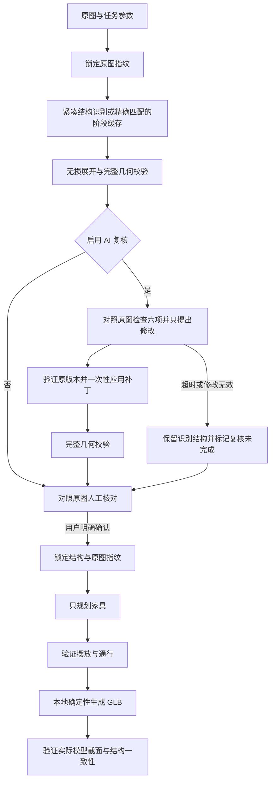

# 户型图到三维：准确性与耗时设计

适用场景：本地单人、浏览器连接本机服务。保持现有 Codex 登录、所选模型和推理强度；生成 GLB 无需 Blender。

## 1. 已观察到的瓶颈

本机既有任务的事件记录（同一张原图）显示：

| 既有任务 | 模型 / 强度 | 识别 | 复核 | 结果 |
| --- | --- | --- | --- | --- |
| `65724e11…` | gpt-6.1-sol / high | 约 367 秒 | 约 204 秒 | 进入人工核对 |
| `a1cb6e59…` | gpt-6.1-sol / medium | 约 254 秒 | 约 639 秒 | 旧版复核超时失败 |

这是历史单次观测，不能当作不同推理强度的性能对照。网络、服务排队和模型输出长度都会影响耗时。

原流程的主要重复：识别输出一份完整 Layout，复核再次完整生成同一份 Layout；解析错误还可能重复生成。成功阶段在普通重试时没有可验证的跨任务复用。

## 2. 调整后的流程



### 紧凑传输，不改变几何精度

- `[x,y]` 替代重复的 `{"x":x,"y":y}`；墙体用短字段传输。
- 全部坐标、厚度、高度、门窗范围、门扇方向、地面材质和证据灯位均保留。
- 不四舍五入坐标、不简化轮廓、不强制轴对齐、不删除真实转折。
- 内部及下载的 Layout 格式保持不变。传输格式经过完整 Pydantic 和几何校验后再展开、保存。

### 复核只输出补丁

- 必须对照原图检查轮廓、比例、房间、墙体、开口、通行六项。
- 补丁携带原结构版本，不能应用到其他户型。
- 新增、修改、删除分别明确指定 ID；每项带原图依据。
- 未提及的对象保持原值。门窗按受影响墙体替换，不能隐式丢弃其他墙的开口。
- 在副本上一次性合并后执行完整几何校验；失败时不写入部分结果。
- 有歧义的判断记录为警告。AI 的自报置信度不能替代人工核对。
- 无修改时无需重写全部坐标。完整 `review.json` 由程序合并生成，另存 `review-patch.json` 供检查。

### 有条件的阶段复用

缓存依赖原图 SHA-256、任务输入、项目技能内容、输出 schema、流程版本、模型、强度及本地运行环境指纹。真实 CLI 的环境指纹包括服务商、账号指纹和 CLI 文件版本信息；缓存不保存登录凭据。

仅保存完整且通过校验的阶段结果。读取时验证内容摘要，再执行当前 schema、几何及原图检查。输入或版本改变即不命中；损坏缓存按未命中重新生成。同一进程中的相同请求共享阶段结果。

缓存不继承人工确认。不同任务仍使用独立工作区、独立确认和独立成果。用户明确选择“核对户型结构”或“重新规划家具”的改进操作会绕过阶段缓存，允许重新分析。

### 时间预算与恢复

- 单阶段完整预算包含模型启动、排队、修正和结果返回，默认不超过 `CODEX_TIMEOUT_SECONDS=600`；解析或校验错误最多修正一次，修正与首次调用共享预算。
- 可选复核还有独立的 `AI_REVIEW_TIMEOUT_SECONDS=300` 上限；超时后中止调用并进入明确标记的人工核对，不把未完成的复核描述为已通过。
- 修改建议在一次修正后仍不通过校验时，保留原候选并标记复核未完成，禁止应用无效或部分修改。
- 进程清理和本地文件操作可能带来少量额外时间；这些值不是远端服务的响应保证。
- 已完成的识别不会因复核超时丢弃。旧失败任务可恢复有效识别结构。
- 家具规划不能修改已确认的墙体、房间及门窗；确认版本和原图指纹在建模前后检查。

## 3. 可测量性

每个任务保存 `pipeline-metrics.json`：阶段、实际模型/强度、尝试次数、缓存命中、输入/输出字符数、首个输出时间及阶段耗时。GLB 构建与导出校验也计时。字符数不是 token 数，不用于推算固定加速比例。

真实调用验证命令：

```powershell
.venv\Scripts\python.exe -X utf8 scripts/benchmark_ai.py --source data/jobs/任务ID/source.png --model gpt-6.1-sol --effort medium
```

验证使用 `data/ai-benchmarks/` 下独立数据库，分别记录首次调用及完全相同输入的复用耗时，停在人工核对阶段，不修改用户任务或自动确认原图。结果写入对应目录 `report.json`。单张图的实测不代表所有图片或网络环境。

## 4. 验收要求

1. 紧凑格式往返后，所有 Layout 字段及结构指纹一致。
2. 错误版本、未知/重复 ID、越界开口、重复墙和悬空门窗引用均拒绝；原候选结构保持不变。
3. 缓存不能跨原图、要求、模型、强度、schema、技能或环境使用；损坏结果必须重新生成。
4. 原图在处理期间变化时停止，不发布来源不匹配的结果。
5. 无论是否命中缓存、复核是否完成，未经人工确认不能生成或下载最终 GLB。
6. 完整流程测试必须覆盖人工确认、家具校验、真实 GLB 和最终截面一致性。

### 生成阻断策略

- 疑似平行重复墙、缺少入口等图像判断只提示，保留原有结构供用户核对，不因启发式判断中止生成。
- 自动家具布置出现穿墙、堵门或重叠时先本地调整：平移不超过 0.25 米、缩小不超过 10%；仍放不下时仅暂缓该家具并记录说明。原始 AI 输出之外不改动确认的墙体、门窗和房间。
- 家具尺寸是否符合常规使用习惯属于建议，不阻断建模。手动布置不会被自动移动或删减。
- 家具 AI 超时或两次结构化响应均无法读取时先交付房屋结构，`delivery_status=structure_ready`，页面显式提示家具未完成，并提供完善家具入口；不能将其描述为完整家具方案。
- 损坏的结构、多边形自交、悬空引用、真实来源变化、确认结构不匹配以及实际 GLB 截面不一致仍会阻断，避免交付错误户型。数值等价写法（如 `90` / `90.0`）不会改变结构指纹，旧确认记录只在原始快照与当前结构核对一致时兼容。
- 正在处理的任务在服务关闭时保留为待继续，启动后验证原图、任务参数与确认记录，并从 LangGraph 检查点继续；不会重新确认用户，也不会自动重跑已完成的识别节点。
- 临时 AI 连接错误最多重连一次，并计入原有阶段总时限，不变更用户选择的模型。复核或家具阶段连接持续不可用时分别回到人工核对或显式交付房屋结构。

### 成功率统计

`scripts/report_generation_success.py` 只读任务数据库，分别记录已结束任务成功率、完整交付比例、待核对任务、失败原因、不同原图及策略版本。`--replay` 在独立目录重新构建每个原图最近成功的方案，验证建筑结构未变及真实 GLB 截面；回放不作为新原图识别成功率样本。报告保存在 `data/success-audits/`。新任务结果保存 `generation_policy_version`，避免把旧版本失败或仅结构交付混入当前完整方案成功率。

## 5. 本机首次验证记录

2026-10-07，同一原图、`gpt-6.1-sol / medium`，一次隔离真实调用：

| 阶段 | 耗时 | 输出字符数 | AI 调用次数 |
| --- | --- | --- | --- |
| 结构识别 | 264.389 秒 | 8,566 | 1 |
| 增量复核 | 56.771 秒 | 785 | 1 |
| 达到人工核对页面 | 325.928 秒 | — | 2 |
| 相同输入复用，含校验 | 阶段处理约 0.22 秒；旧验证脚本轮询观测约 5 秒 | 结果一致 | 0 |

复核根据原图修正了儿童房入口连接位置，补丁通过完整校验。复用前后结构指纹一致，两个任务都停在人工核对阶段。原图往返测试使用已保存的识别结构，紧凑格式将 10,828 字符减少至 8,620，所有字段和坐标精度保持一致。

后续使用同一候选结构执行隔离的家具与真实建模性能验证：

| 阶段 | 首次运行 | 相同输入复用 |
| --- | --- | --- |
| 家具规划及校验 | 107.562 秒，1 次 AI 调用 | 0.075 秒，0 次 AI 调用 |
| GLB 构建及导出一致性校验 | 2.532 秒 | 2.433 秒 |
| 家具到交付阶段总耗时 | 110.269 秒 | 2.654 秒 |

两次真实 GLB 的 SHA-256 相同；五个墙体截面的面积差均为 0，房间地面和户型轮廓校验通过。该性能测试使用明确标记的 `benchmark_fixture`，不代表人工核对；成果的 `source_reviewed=false`，没有确认或修改用户任务。记录在同一隔离目录的 `delivery-report.json`。

```powershell
.venv\Scripts\python.exe -X utf8 scripts/benchmark_delivery.py --run data/ai-benchmarks/验证目录ID
```

本次各自动阶段首次运行合计约 7 分 16 秒，不含实际人工核对时间；5 分 26 秒只代表达到人工核对页面。相较既有记录，复核输出和等待明显减少，识别阶段仍是当前主要耗时。单次测量不能隔离网络和远端负载，也不能证明所有户型的还原度或加速比例。新户型仍需 AI 分析，缓存只加速完全匹配且已通过校验的阶段。

设计参考：[OpenAI 官方延迟优化](https://developers.openai.com/api/docs/guides/latency-optimization)建议减少不必要的模型输出和重复请求；[结构化输出文档](https://developers.openai.com/api/docs/guides/structured-outputs)用于确认输出约束。实际速度以本机测量为准。几何校验只保证结构合法、模型与确认结构一致；图片理解的正确性仍需对照原图核对。
